# Home Lab v2

My personal AI system: model access, knowledge retrieval with sources, and durable background jobs.

> [!WARNING]
> **In development.** Model access, knowledge retrieval with cited answers and durable jobs run on the node today; applications such as med-ask build on it.

## Overview

Every side project needed model access without keys scattered across repositories, search over
my own knowledge with answers that show their sources, and work that keeps running in the background.
HomeLab builds these once on a small always-on server that my projects plug into.
This second version keeps the lessons from the learning-first v1 and leans on mature tools.

## Architecture

<picture><source media="(prefers-color-scheme: dark)" srcset="docs/diagrams/architecture-dark.svg"></picture>

Solid parts are built; dashed parts are planned.

- The diagram shows where HomeLab is heading: one API for every client. Today med-ask reaches
  only LiteLLM, over the `homelab-models` network.
- Knowledge endpoints: `POST /v1/knowledge/query` and `/v1/knowledge/answer`; jobs persist in Postgres.
- [ARCHITECTURE.md](ARCHITECTURE.md) explains the boundaries and rules;
  [DECISIONS.md](DECISIONS.md) records the choices behind them.

## Quick start

```bash
# Development (no services)
uv sync
uv run pytest
```

Running the stack needs a provisioned node; see the [operator runbook](docs/operations.md#run-it).

## Project structure

| Path | What |
|---|---|
| `src/homelab/api/` | FastAPI API |
| `src/homelab/models/` | Purpose discovery and model clients |
| `src/homelab/knowledge/` | LlamaIndex ingestion and retrieval |
| `src/homelab/jobs/` | Procrastinate tasks and worker |
| `config/litellm.yaml` | Model purposes and routes |
| `node/` | Host files at their installed paths |
| `mac/` | Measurements, vision serving and action listener |

First version: [homelab-v1](https://github.com/TelesforoAleix/homelab-v1)

Used by: [med-ask](https://github.com/TelesforoAleix/med-ask)

[Operator runbook](docs/operations.md): running the stack, Mac services, node rebuilds and originals copies.
